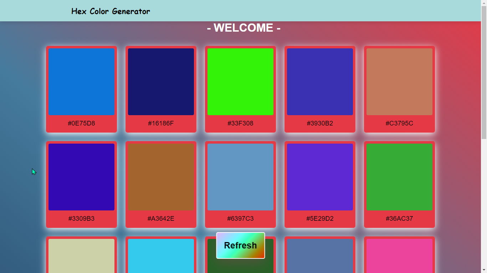

# Hex Color Generator

## Overview

The **Hex Color Generator** is a web-based tool that generates a palette of random hexadecimal colors. With a simple interface, users can quickly copy any hex code to their clipboard, making it an ideal tool for designers, developers, and anyone working with colors.

## Table of Contents

- [Demo](#demo)
- [Features](#features)
- [Technologies Used](#technologies-used)
- [Getting Started](#getting-started)
- [Usage](#usage)
- [Project Structure](#project-structure)
- [Contact](#contact)

## Demo

Try the live version of the Hex Color Generator [here](https://ziadwaleed23.github.io/Color-Palatte-Generator/).

## Features

- **Random Hex Color Generation**: Generates 23 unique hex colors each time.
- **Copy-to-Clipboard**: Click any color to instantly copy its hex code.
- **Responsive Design**: Optimized for all screen sizes, from mobile to desktop.
- **Intuitive UI**: Simple and clean user interface.
- **Refresh Palette**: Quickly generate a new set of colors with the "Refresh" button.

## Technologies Used

- **HTML5**: Structure of the web page.
- **CSS3**: Styling and responsive design.
- **JavaScript (ES6)**: Logic for generating colors and handling user interactions.

## Getting Started

To run the Hex Color Generator locally, follow these steps:

## Usage

Generating Colors: Click the "Refresh" button to generate a new set of hex colors.
Copying Colors: Click on any color box to copy the hex value to your clipboard.

## Project Structure

hex-color-generator/
│
├── index.html          # Main HTML file
├── style.css           # CSS file for styling
├── script.js           # JavaScript file for color generation
├── image/              # Folder containing images (e.g., favicon)
│   └── icon.jpg        # Favicon used in the project
└── README.md           # Documentation file

## Contact

For any inquiries or feedback, please contact:

Name: Ziad Waleed
Email: zezowaleed333@gmail.com

                                                         © 2024 Ziad Waleed. All rights reserved.
